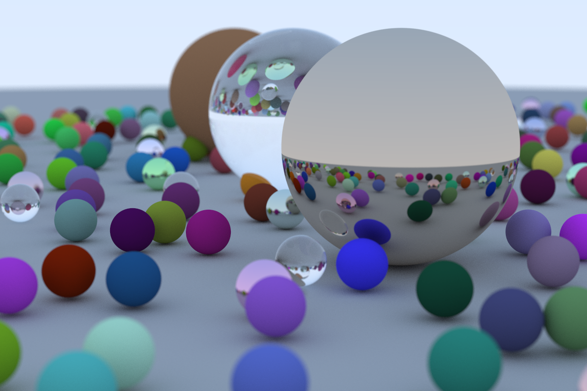

  <h1><code>rain</code></h1>

  

    <strong>A wanna be raytracer for rust.</strong>
  

Built with 🦀 by <a href="https://github.com/qu4k">Filippo Rossi</a>

<kbd>
  
</kbd>

## Maintainers

- Filippo Rossi ([@qu4k](https://github.com/qu4k))

## Other

### Contribution

Pull request, issues and feedback are very welcome. Code style is formatted with `cargo fmt` and commit messages are done following Conventional Commits spec.

### Licence

Copyright 2020-present, Filippo Rossi. All rights reserved. MIT license.
